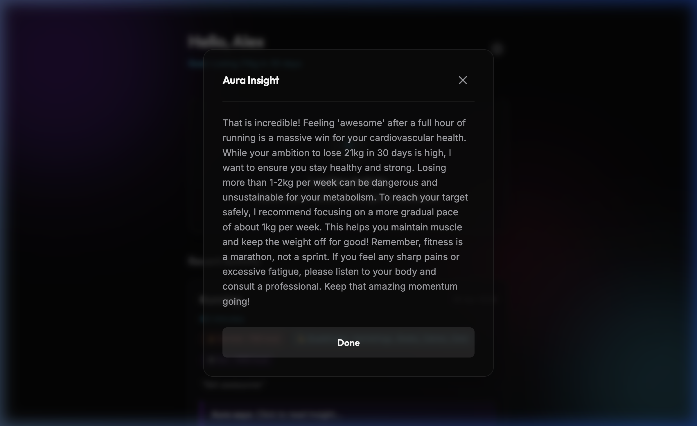

# Aura - AI Fitness Tracker

Aura is a modern, personalized, web-based fitness tracking application powered by Google's Gemini 3 AI. It allows users to log their workouts and receive highly intelligent, context-aware insights, dietary recommendations, and safety check-ins tailored to their personal physical profile and fitness goals.

## Features

- **Premium Interface:** A highly polished dark-mode UI with glassmorphism components, responsive design, and smooth CSS micro-animations.
- **Serverless Architecture:** The app runs entirely in the browser using Vanilla HTML, CSS, and JS. It communicates directly with the `gemini-3-flash-preview` API.
- **Secure Local State:** All user profiles and workout history are securely saved and persisted on your device using browser `localStorage`.
- **Intelligent Activity Parsing:** When you log a workout, the AI analyzes it and automatically extracts and tags:
  - 🔥 **Calories Burned:** An estimation of calories burned during the session.
  - 💪 **Targeted Muscles:** The primary muscle groups engaged in your workout.
  - 🍽️ **Dietary Target:** An estimation of how many daily calories you should eat to sustainably reach your fitness goal based on your age, weight, height, and activity level.
- **Strict Safety Guardrails:** Aura is designed with robust safety instructions. It will strictly refuse to give medical advice, and it actively monitors and pushes back against dangerously fast weight loss goals or unsafe dietary limits (e.g., eating below 1200 kcal/day).
- **Bulletproof Reset:** A custom-built data wipe feature allows you to completely clear your local storage and cache, ensuring your data is permanently deleted when you want to start fresh.

---

## Safety Guardrails in Action

Aura prioritizes your health and safety. In the example below, a user attempts to set an extreme goal of losing 21kg in 30 days. Rather than simply encouraging the user, Aura's safety guardrails activate, gently pushing back against the medically unsafe and unsustainable objective:



---

## App Walkthrough

Check out this demonstration of Aura's normal workflow—from creating a completely new profile and setting an API key, to logging an activity and receiving beautiful, tagged AI feedback:


---

## How to Run Locally

Because Aura is a purely frontend application, you just need a simple HTTP server to avoid local file CORS restrictions:

1. Open a terminal and navigate to this folder.
2. Run the built-in python server:
   ```bash
   python3 -m http.server 8080
   ```
3. Open your browser and navigate to `http://localhost:8080/`.
